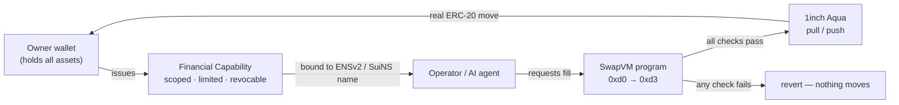
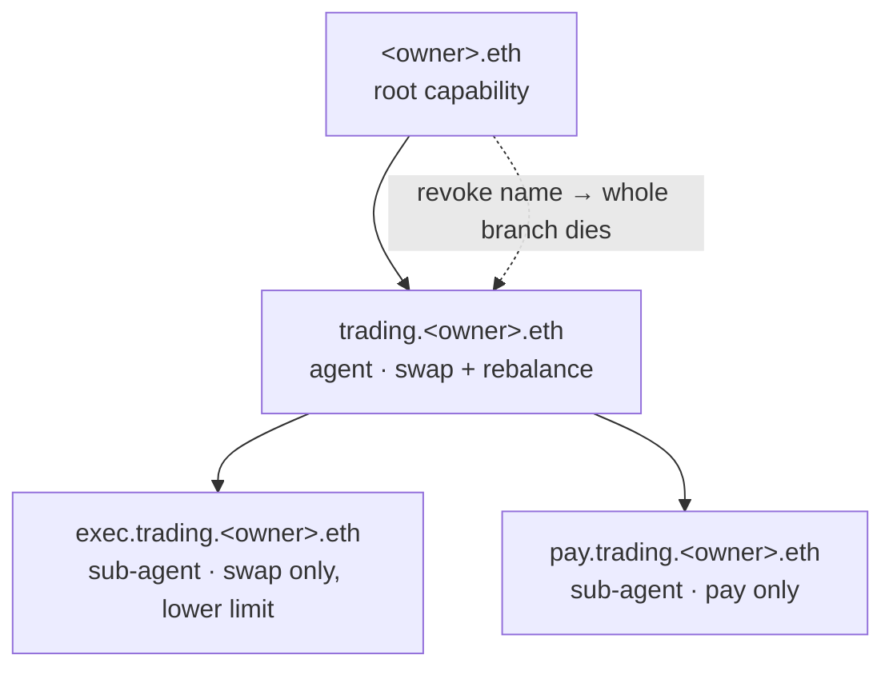

# BUCKET — Self-Custodial Financial Capability Protocol

> **We don't delegate wallets. We delegate Financial Capabilities.**

A Bucket never becomes your custodian. Your assets stay in **your** wallet. What you hand an operator — a human or an
AI agent — is a **Financial Capability**: a scoped, revocable, time-bound, policy-bound, amount-limited right to do
*one* kind of action. It's enforced live on-chain on every call, never by the frontend. Runs natively on **two
chains** (EVM + Sui), independently issued and enforced.



---

## Where 1inch is used: **Aqua = liquidity, SwapVM = execution**

The EVM execution layer is built directly on **1inch [SwapVM](https://github.com/1inch/swap-vm) + Aqua**. A Bucket's
strategy is a SwapVM program shipped to Aqua, so Aqua virtual balances and the program share one execution path —
assets never leave the owner's wallet: the taker pays `tokenIn` via `transferFrom + Aqua push` and receives `tokenOut`
via Aqua `pull` from the holder.

| Piece | Code |
|---|---|
| SwapVM router (instruction set *is* the Bucket program) | [`BucketSwapVMRouter.sol`](contracts/evm/src/vm/BucketSwapVMRouter.sol) |
| Ship strategy → Aqua | [`sdk/evm/client.ts:268`](packages/sdk/src/evm/client.ts#L268) · [`onboard.ts:235`](apps/dex/src/lib/client/onboard.ts#L235) |
| Fill via Aqua pull/push | [`sdk/evm/client.ts:459`](packages/sdk/src/evm/client.ts#L459) |

Sui settles natively instead (real `Coin<T>` via PTB) — [`bucket.move`](contracts/sui/sources/bucket.move).

---

## The opcodes: `0xd0 → 0xd3`

The Bucket program is a canonical SwapVM program ([`BucketOpcodes.sol`](contracts/evm/src/vm/BucketOpcodes.sol)).
`quote` and `swap` run it identically (all `view`), so preview and real fill can never diverge.

| Op | Instruction | Answers | Code |
|----|---|---|---|
| **0xd0** | `BucketCapabilityGuard` | May this taker fill this order now, under which capability? (identity, intent, whole delegation chain, ENSv2, venue) | [↗](contracts/evm/src/vm/BucketCapabilityGuard.sol) |
| **0xd1** | `BucketQuote` | At what price? (reference + policy-bounded Dutch concession, rebalance direction, no overshoot) | [↗](contracts/evm/src/vm/BucketQuote.sol) |
| **0xd2** | `BucketSpendLimit` | Within every bound? (per-exec, hourly, daily, turnover, intent, Aqua budget) | [↗](contracts/evm/src/vm/BucketSpendLimit.sol) |
| **0xd3** | `BucketWalletBalanceCheck` | Does the holder's *real* ERC-20 balance still cover it? | [↗](contracts/evm/src/vm/BucketWalletBalanceCheck.sol) |

The **agent** can never move funds outside this program: it validates via `previewSwap` (runs `0xd0→0xd3` off-chain,
[`agent.ts:215`](apps/dex/src/lib/server/agent.ts#L215)) then fills via `executeSwap`
([`agent.ts:573`](apps/dex/src/lib/server/agent.ts#L573)).

---

## Hierarchy: how ENSv2 makes delegation safe

A capability delegates into a **strictly narrower** child ([`BucketCapabilities.delegate()`](contracts/evm/src/BucketCapabilities.sol)):
assets, venues, permissions, limits and time only shrink (monotone attenuation), depth is capped, and usage is charged
to the whole chain. Crucially, **the ENSv2 name tree *is* the delegation tree** — a child is issued to an ENSv2
subname of its parent operator, so the naming hierarchy and the authority hierarchy stay in lock-step.



**Why this is useful to us:**
- **Verifiable agent identity** — each operator has a human-readable name (`exec.trading.<owner>.eth`) that resolves
  live to its address; that binding is what an **ERC-8004** AgentCard publishes ([`agent-card.ts`](apps/dex/src/lib/server/agent-card.ts)).
- **Sub-delegation without widening** — an agent can spin up a narrower sub-agent under its own subname; it can never
  grant more than it holds. Rules: [`BucketPermissions.sol`](contracts/evm/src/libraries/BucketPermissions.sol).
- **Branch-level kill switch** — revoking a name (or `revokeAll`, which bumps the epoch) severs that whole subtree at
  once — [`sdk/evm/client.ts`](packages/sdk/src/evm/client.ts).
- **Same model, both chains** — this is ENSv2 **Enhanced Access Control (EAC)** semantics, ported Move-native on Sui
  (resource-scoped nybble-packed role bitmaps, per-role admins, `ROOT_RESOURCE`, guardians) —
  [`access.move`](contracts/sui/sources/access.move).

Every capability is bounded by its Bucket **policy**, validated identically in Solidity/Move/TS:
[`BucketPolicyLib.sol`](contracts/evm/src/libraries/BucketPolicyLib.sol) (invariants I1–I10) ·
[`policy.move`](contracts/sui/sources/policy.move).

---

## Identity: ENSv2 & SuiNS

Names answer *who*, never *what* — the **address** is always the security principal.

- **ENSv2 (EVM)** — resolved by descending the registry tree (`getSubregistry` per label), not ENSv1 namehash —
  [`ens/ensv2.ts`](packages/sdk/src/ens/ensv2.ts).
- **SuiNS (Sui)** — `resolve_suins_principal` reads the real on-chain SuiNS registry for the target address, which
  becomes the EAC principal — [`sui/bucket.ts:604`](packages/sdk/src/sui/bucket.ts#L604).

---

## RALE — Risk-Adaptive Liquidity Engine

[`apps/dex/src/app/rale/page.tsx`](apps/dex/src/app/rale/page.tsx) · `/rale`. A Bucket quotes a *state-dependent*
maker price that reacts to inventory, volatility and trade size, then settles through the same opcodes:

```
P(q, Sₜ) = P*·(1 − λ·Iₜ) ± Pₜ·( sₜ/2 + η·|q|/L )     sₜ = s₀ + α·σₜ + β·|Iₜ|
```

Inputs are **real** (on-chain prices + balances; session-observed σ), the visual is a hand-built 3D cost surface, and
**Execute** routes through Aqua + SwapVM gated on a live Swap capability. RALE is the *policy*; the opcodes are the
*enforcement*.

---

## Run it

```bash
pnpm install
pnpm dev   # Vite SPA :3100, Hono API :3101
```

Client holds **no secrets** (RPC / agent / OpenAI keys are server-side — [`apps/dex/AGENTS.md`](apps/dex/AGENTS.md)).
Testnets only. Addresses: [`deployments/sepolia.json`](deployments/sepolia.json).

---

*SwapVM & Aqua integration powered by [1inch SwapVM](https://github.com/1inch/swap-vm) — © Degensoft Ltd 2025.*
